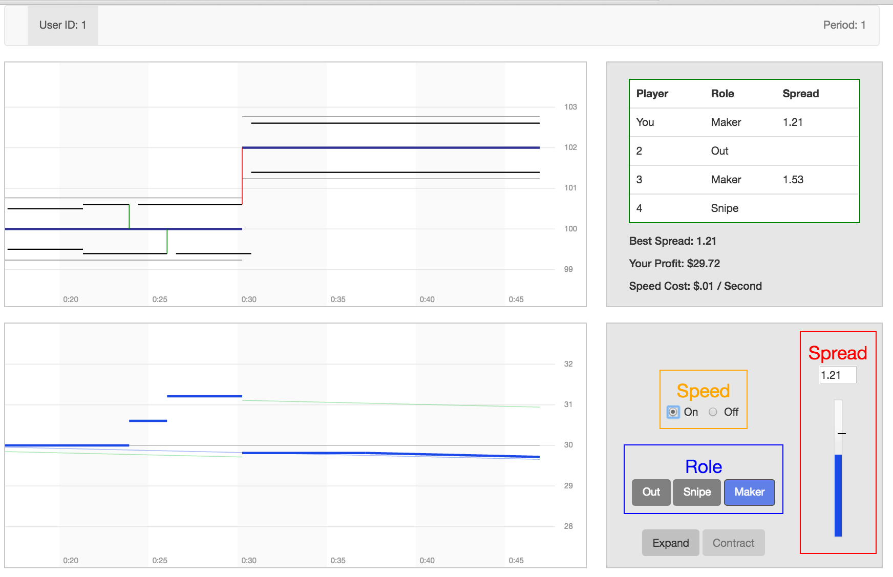

## Experimentos en Transacciones de Alta Frecuencia

Eric Aldrich,  Dan Friedman,  Kristian López-Vargas 
<!--Let's discuss scope of presentation (whole vs lab); Where do we mention Peter? etc-->
University of California, Santa Cruz

Pontificia Universidad Católica del Perú

Lima, marzo 2017

--------------------------------------------------------

## Motivación

* La velocidad de transacciones ha disminuido rápidamente.

* las Transacciones de Alta Frecuencia (HFTs) representan una gran fracción de operaciones en todo el mundo.

* A favor: HFT aumenta la liquidez, reduce los costos de transacción.

* En contra: El costo de la infraestructura de HFT es soportado por los inversionistas; La liquidez desaparece cuando más se necesita.

<!-- ## Motivation  -->

<!-- * Trading latencies have rapidly declined.  -->

<!-- * HFTs account for a large fraction of trades worldwide. -->

<!-- * Proponents: HFT increases liquidity, reduces transaction costs.  -->

<!-- * Opponents: The cost of HFT infrastructure is borne by investors; liquidity vanishes when most needed. -->

--------------------------------------------------------

## Plan de investigación

* Los datos existentes son insuficientes para resolver la controversia.

* Los experimentos son una alternativa superior para comparar científicamente los formatos de mercado en presencia de HFT.

* En este paper utilizamos experimentos (de laboratorio (y de campo)) para comparar formatos de mercado relevantes.

<!-- ## Research Plan   -->

<!-- * Existing data are insufficient to resolve the controversy. -->

<!-- * Experiments are a superior alternative to scientifically compare market formats in the presence of HFT. -->

<!-- * We use experiments (lab and field) to compare relevant market formats. -->

--------------------------------------------------------

## Diseño de la investigación

* **Examinar 3 formatos de mercado**:

    * Subasta doble continua (CDA).
    
    * Dos alternativas:  FBA, IEX.

** **Dos etapas**:

     * Laboratorio (en curso).
     * Campo (torneo abierto, en inicios).
 
* **Resultados y métricas de desempeño**: liquidez, estabilidad y costos de transacción.

--------------------------------------------------------

## Formato baseline

* Formato de mercado base: subasta doble continua (CDA)

     * Organiza el comercio en casi todos los principales intercambios.
     
     * Pedidos procesados inmediatamente con prioridad de precio-tiempo.
 
     * La tecnología de velocidad es crucial.

--------------------------------------------------------

## Formatos de mercado alternativos
     
* Formatos alternativos intentan reducir los incentivos por velocidad.
   
    1. Subasta por lote frecuente (FBA): igualdad de prioridad a los pedidos recibidos en el mismo lote (por ejemplo, durante una décima de segundo).

    2. IEX: retrasa las órdenes entrantes en 350 $ \ smash {\ mu} $ s, permite órdenes ocultas y "vinculadas".

    3. Otros
    
--------------------------------------------------------

## Implementación en el laboratorio

* Entorno de laboratorio <u> simple </u>:

     * Basado en Budish, Cramton y Shim (BCS, 2015).
    
     * CDA y FBA

* Los participantes operan algoritmos que envían órdenes en su nombre.

* Se añaden características pertinentes de los intercambios modernos de uno en uno.

---------------------------------------------------------

## Ambiente de lab 1: CDA en BCS
 
* No hay asim de información o costos de inventario, todos son neutrales al riesgo.

* Valor fundamental, públicamente observado  $ V(t) $ (Poisson jump process),

* Inversores exógenos llegan al mercado aleatoriamente

* "Makers" postean bids/asks y "snipers" esperan oportunidades de arbitraje.

* Después de un salto de $ V $:
    
    * _Makers_ tratan de actualizar.

    * _snipers_ tratan de comprar (vender) una cotización "obsoleta" y liquidar al nuevo valor fundamental.

* Hay la posibilidad de reducir latency con subscripción a una mejor tecnología de comunicación.

---------------------------------------------------------

## Ambiente de lab 1: CDA en BCS

* En equilibrio, el _market spread_ es positivo $ s^\* > 0 $ , pero...

* No hay ganancias por que hay que pagar la subscripción

* Sólo queda un maker y el resto es sniper

----------------------------------------------------------

## Ambiente de lab 1: CDA en BCS

----------------------------------------------------------

## Ambiente de lab 2: FBA en BCS

* Las órdenes de compra venta son recibidas de forma continua.

* El día de negociación es dividido en muchas fases de igual duración, el batch o lote ($ \\tau $).
 
* Al cierre del batch, todas las órdenes de compra (venta) se combinan para generar una curva de demanda escalonada (oferta).

* Se calcula el precio de equilibrio $ p^\star $, y las ordenes inframargales se ejecutan a dicho precio.

----------------------------------------------------------

## Ambiente de lab 2: FBA en BCS: Equilibrio
 
* Casi todos los saltos del valor fundamental no ponen en riesgo las órdenes de los _makers_. Entonces el incentivo a ser rápido se desvanece.

* Competencia Bertrand: hasta alcanzar bid-ask spread nulo $ s^\* = 0 $.

* Los snipers solo hacen ganancias en eventos muy improbables.

* Si $\smash{\tau >> \Delta \delta \Rightarrow}$ Nadie invierte en speed.

----------------------------------------------------------

## Ambiente de lab 2: FBA en BCS:

----------------------------------------------------------

## Pilot Experiment 

* Redwood II interface.

* Two market formats in the session: CDA and FBA. 

* Three 5-minute _trading days_ (periods), per format.

* Each trading day had two markets (groups of four traders). 
    
* Session lasted approx 100 minutes.

* Realizations matched across groups and formats.

--------------------------------------------------------

## Pilot Parameters    

* $\smash{\lambda_V=4}$: $\smash{V(t)}$ jumps every 4 seconds.
    <!--* Historical SPY ETF data $\smash{\Rightarrow}$ 5-min lab session corresponds to 1.5 min of market trading.-->
        
* $\smash{\lambda_I= 3}$: Investor arrivals every 3 seconds.
        
* $\smash{V_0 = 100}$: Order of magnitude equal to liquid equities.
        
* $\smash{F_V = N(0,0.5)}$.
<!--Standard deviation is relatively large to price increments in data, but the magnitude is arbitrary if subjects can scale spreads accordingly.-->

--------------------------------------------------------

## Pilot Parameters   
        
* $\smash{c_s= \$0.01/s}$.
<!--Roughly twice the cost (per symbol, per second of a trading day) for a premier microwave service.-->
        
*  $\smash{\delta_{slow} = 0.5s}$: About 10 times larger than actual
   Chicago $\smash{\rightarrow}$ NY latency, after accounting for our
   time scaling.
    
* In FBA, batch interval was 5 secs (1.25 secs, market time); reporting lag was essentially zero; default latency / interval = 0.1.

----------------------------------------------------

## Summary Results

| | MAKER | SNIPE | Speed | Spread | NumTrades | RMSE |
| --- | :---: | :---: | :---: | :---: | :---: | :---: |
| **CDA** | | | | | | |
|P1 | 63.5% | 33.8% | 43.2% | 0.80 | 109.5 | 0.50% |
|P2 | 62.2% | 35.5% | 53.5% | 0.46 | 140.5 | 0.37% |
|P3 | 60.0% | 38.3% | 66.0% | 0.40 | 158.0 | 0.39% |
| **FBA** | | | | | | |
|P1 | 66.9% | 31.9% | 28.5% | 0.44 | 87.5 | 0.42% |
|P2 | 74.2% | 25.0% | 22.3% | 0.25 | 85.0 | 0.26% |
|P3 | 79.9% | 19.4% | 11.1% | 0.21 | 91.0 | 0.30% |
| | | | | | | |

--------------------------------------------------

<!------------------------------------------------------------>

<!--## Pilot Session-->

<!--* Simplest lab environment is adapted from BCS.-->
 <!---->
<!--* Single asset, single exchange, continuous price.-->

<!--* $\smash{V(t)}$: exogenous, compound Poisson process, jump rate $\smash{λ_V}$, jump distribution $\smash{F_V}$.-->
 <!---->
<!--* Automated investors: exogenous stream of market buy/sell orders, Poisson arrival rates $\smash{\lambda_I}$.-->

<!--* Traders control bots/algorithms which place orders on their behalf, conditional on market conditions and strategies (_{out, making, sniping}_, _{fast, slow}_).-->
 

<!-- The simplest lab environment is adapted from BCS. A single asset is traded on a single exchange, and price is a continuous variable. The fundamental value V(t) is determined exogenously by a compound Poisson process with arrival rate λ_V and jump distribution F_V. Players’ profit opportunities come from “investors” represented by an exogenous stream of unit market orders to buy (limit price very high) and to sell (limit price 0) with Poisson arrival rates λ_B=λ_S=λ_I.-->

<!-- -------------------------------------------------------- -->

<!-- ## CDA in the Lab -->

<!---->

<!--  -->

<!--Eric, the options for resizing in reveal.js depend on the available extensions and markdown "version" [ideas?]-->

<!--Layout Legend: 
CDA user interface in BCS environment. Traders use the action box (bottom right) to adjust choices at any moment during the trading period. To (re)enter as a market maker she clicks the “maker” button or just drags the “Spread” bar to adjust s. To (re)enter as a sniper, she clicks the “snipe” button. By clicking the “Out” button, a player cancels any limit orders, deactivates sniping bots and unsubscribes from speed services. The event history box (top left) displays the time path of the fundamental value V(t) as a piecewise constant blue line, the trader’s own bid and ask as black horizontal lines, investor transactions as green vertical lines, snipe events as red vertical lines, and other traders’ limit orders as gray horizontal lines. The information box (top right) displays the current bid-ask spread, other traders’ status and the cost of speed cs. The profit history box (bottom left) displays players’ accumulated profit at each moment of time.-->

<!--Figure Events Legend: 
The event history box indicates that player 1 is about 48 seconds into the trading day, and has been a maker for at least 30 seconds. Her current spread of 1.21 is the best (smallest) of the two current makers. Investors arrived around seconds 23 and 26 with market orders to buy and sell, respectively. The green vertical lines in the event history box at those times, and the corresponding upward jumps in the profit history box, show her resulting profit. Around second 30, V jumped from about 100 to 102 and player got sniped by player 4, reflected in the red vertical line connecting the stale quote to the new V and the corresponding drop in profit. Note that profit is flat between events if “Speed” is turned off, but has a slight negative slope (of cs) when “Speed” is activated.
-->

<!-- -------------------------------------------------------- -->

<!-- ## FBA in the Lab -->

<!--  -->

<!---->

<!--Figure Layout Legend: FBA user interface in basic BCS environment. The action box, information box and profit history box are essentially the same as in Figure 2. In the event history box (top left), the thin black horizontal line segments depict V(t), and the gray vertical lines separate the 5-second batching intervals. The color-coded ticks depict the order book at auction times: blue for own orders, lighter blue for other traders’ orders and light purple for investors. Trader 1’s own filled orders (and those of other traders) are indicated by a green (gray) dot behind the corresponding tick. The red tick shows the clearing price.-->
<!--Play / Events Legend:
 Total time 48 seconds. A buying investor arrived during the batching interval [20,25), and a selling investor arrived during the batching interval [30,35). In both batches, trader 1 had the best spread (at 0.9) and had an order filled profitably. 
 Snipers not depicted in the figure. -->

<!-- ##  Next Steps and Discussion -->

<!-- * Development and Productions. -->

<!-- * More realism in environment.  -->

<!-- * Evidence from the lab and tournaments will improve understanding of -->
  <!-- financial market design (help regulation and policy) -->

<!-- * Our infrastructure will be a contribution for future research.  -->

<!--Exploring these differing environments will contribute to fundamental knowledge regarding financial market design. By introducing features one at a time, we will make strong inferences about which environmental aspects shape observed outcomes. By holding constant the realized stochastic process across market formats in any given environment, we can draw causal conclusions regarding comparative performance. For example, we will be able to make clear statements such as “relative to the basic CDA baseline, the IEX format lowers trading cost by 5-8% in normal environment X, but increases value-at-risk by 20-30% in stressful environment Y.” Such statements should help focus conventional econometric analysis of market data, and even by themselves should be helpful for regulators and exchange officials. -->

<!--We have started the lab stage developing simple environments that allow for HFT. Our current progress and preliminary evidence are encouraging on the feasibility of the project and and the quality of the collected evidence. Further evidence from the laboratory and the implementation of tournaments will constitute valuable scientific knowledge on which formats best promote financial market liquidity and stability and, thus, help improve the design of financial markets. Our research infrastructure will be an important contribution for future research on financial market design. -->

<!-- -------------------------------------------------- -->

<!-- ##  Thanks to -->

<!-- * Center for Analytical Finance. -->

<!-- * Undergraduate programmers, Morgan Grant and Zach Petersen. -->

<!-- * University of Maryland postdocs, Darrell Hoy and David Malec. -->

<!-- -------------------------------------------------- -->

<!--

// This piece of code below creates the reveal presentation and pushes to GitHub and then deploys to GitHub pages. Modify the commit message and paste it into terminal.

cd docs && \
pandoc  \
-t revealjs -V revealjs-url=reveal.js \
--css=reveal.js/css/theme/simple.css \
-H reveal.js/js/revealMathJax.js \
-s HFT.md -o HFT.html && \
cd ..

cd docs && \
pandoc  \
-t revealjs -V revealjs-url=reveal.js \
--css=reveal.js/css/theme/black.css \
-H reveal.js/js/revealMathJax.js \
-s HFT.md -o HFT.html && \
cd .. && \
git add docs/* && \
git commit -am " add content to HFT.md " && \
git push origin master && \
mkdocs gh-deploy

-->