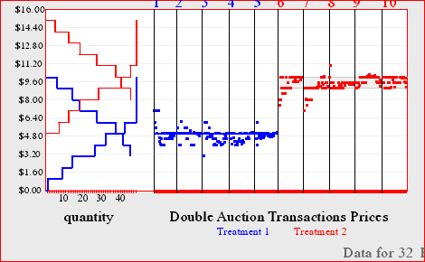
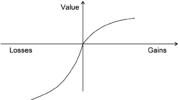
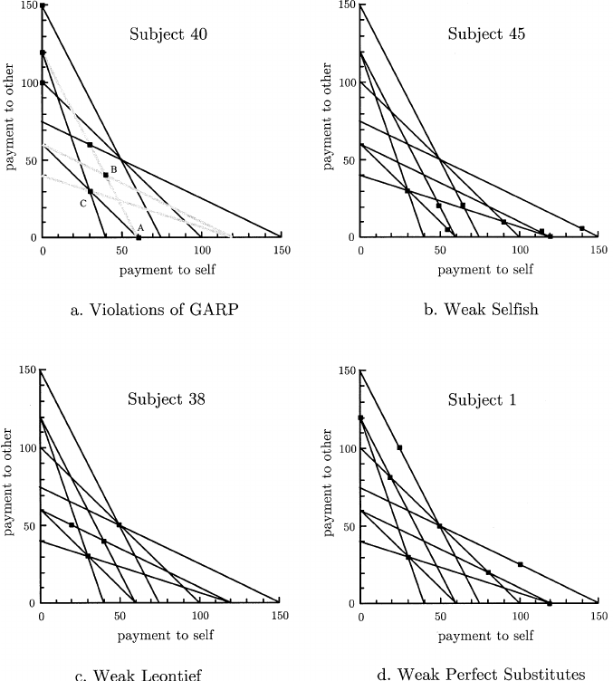

# La Economía Experimental

</b>

 Kristian López Vargas 

 University of California, Santa Cruz 

</b>

 Pontificia Universidad Católica del Perú 

 Lima, marzo 2017 

-----

## Contenido

1. Una introducción breve a la economía experimental y contribuciones

2. Cómo funciona un laboratorio de economía (aspectos prácticos)

3. Una aplicación

-----

# 1. Economía Experimental

------

## Experimentos: qué son

Procedimiento y medición realizados con la finalidad de refutar una hipótesis.

* Control experimental: realizar el "mismo" procedimiento con sólo una diferencia (la de interés).

    * brinda la mejor oportunidad de rechazar la hipótesis.
    <!--  test riguroso: donde rigor es dificultad no formalidad y elegancia técnica-->
    * permite hablar de atribución / causa-efecto.

* Reproducibilidad: generar los resultados consistentes si se repite el procedimiento.

    * clave en el proceso de generación y adopción de nuevas teorías (o extensiones de las actuales).

-----

## Experimentos en economía (?)

_“One possible way of figuring out economic laws (...) is by controlled experiments.
(... however) Economists (...) cannot perform the controlled experiments of chemists or biologists
because they cannot easily control other important factors.
Like astronomers or meteorologists, they generally must be content largely to observe.”_
(Samuelson and Nordhaus, 1985)

------

## Experimentos en economía: sí

Pero...

* La astronomía (por ejemplo) sí se sirve del método experimental por medio de otras ciencias básicas.
<!-- Hay poder predictivo porque sus fundamentos han sido construidos a en base a modelos testetados experimentalmente. Con ladrillos sólidos. -->

* La imposibilidad de experimentar con cuerpos celestes (hasta hoy), no aplica a muchos objetos en la economía (e.g. el consumidor, el mercado, incluso una micro-economía).

* ...entonces, sí podemos experimentar en economía; pero por qué lo haríamos?

------

## Experimentos en economía: por qué

1. Una forma adicional de refutar teorías económicas (como mínimo).

2. El "control experimental" nos permite poner el foco en comportamientos fundamentales en una forma que los datos observacionales usualmente no pueden; y así generar una "ciencia básica" de la economía.

3. Más allá de la teoría: diseño de políticas, mecanismos y mercados.

4. ...
<!--  nuevas evidencias,  -->

------

## Economía experimental (Lab): inicios

* Chamberlain, 1948; Allais, 1953;
<!-- monopolistic competition theory. imperfect competition. have conducted "not only the first market experiment, first economic experiment of any kind," classroom, illustrate how prices don't necessarily reach equilibrium. most market prices are determined by monopolistic and competitive aspects.-->
<!--  -->
* Nobel para Vernon Smith "por el uso de experimentos de laboratorio como una
herramienta en el análisis económico empírico (...) en el estudio de diferentes mecanismos de mercado".

* (E. conductual) Daniel Kahneman "por la introducción de las ideas de la investigación psicológica en la economía,
en particular con respecto a las decisiones bajo incertidumbre".

<!-- * Al Roth and Robert Shiller -->

-----

##  Economía experimental: en la práctica

Ernst Fehr:

_"La economía experimental es esencialmente un método de investigación empírica. Si tiene éxito, (...) se convertirá en un instrumento estándar en la caja de herramientas del economista."_

-----

## EE contribuciones (I): instituciones de mercado

* Smith, 1962, usa la subasta doble (CDA) y encuentra que alcanza alta eficiencia en unos pocos períodos, y con sólo unos pocos compradores y vendedores.

* Plott y Smith, 1978, comparan dos instituciones de mercado, CDA y _posted-offer_, y encuentran que CDA es más eficiente.

* En general el equilibrio competitivo organiza los datos, pese a que no hay subastador que limite el intercambio a precios distintos a los de equilibrio.

    * los precios están en el intervalo previsto.
    * La eficiencia (TS observado / TS potencial) es alto.
    <!--  excedente-->
    * exclusión del mercado es mayormente eficiente

-----

## Smith's double auction

-----

## EE contribuciones (I): instituciones de mercado

* Cientos (en realidad, miles) de experimentos para estudiar mecanismos de mercado se han realizado después de Smith et al.

* Agregación de información: Plott y Sunder, 1982, 1988; Forsythe y Lundholm, 1990; Copeland y Friedman, 1987, 1991.

* Expectativas en convergencia al equilibrio: Forsythe et al, 1982, 1984; Friedman et al, 1984; Anderson et al, 1991.

* Burbujas de precios:  Smith et al, 1988; Noussair y Tucker, 2006.

* ...más allá de mecanismos de precios: "... experimental and computational economics are natural complements to game theory in the work of design..." Roth 2002

-----

## EE contribuciones (II): en economía conductual

* La usuaria más importante de EE ha sido la _economía conductual_. Dos tópicos importantes:

    * Riesgo: _prospect theory_, aversión a la pérdida y efecto dotación (Tversky and Kahneman, 1979; Kahneman, Knetsch, Thaler, 1990;...)

    * preferencias sociales: aversión a la desigualdad, altruismo, confianza (Fehr & Schmidt, 1999; Charness & Rabin, 2001, Andreoni and Miller, 2002; Choi et al, 2006; ...)

-----

## EE contribuciones (II): en economía conductual

</b>

 Prospect theory: $ U(L,r) = \\sum_{i=1}^{i=n} w(p_i) v(x_i - r) $ 

</b>

-----

## EE contribuciones (II): en economía conductual

 Altruism / Aversion a la desigualdad 

------

## Críticas a la economía experimental

Objeciones comunes (basado en Levit y List, 2007):

*	Mucho escrutinio que afecta el comportamiento.
<!--  No hay evidencia solida de experimenter effect-->
*	Omisión o error del los aspectos contextuales.
<!--  -->
*	Tamaños muestrales reducidos.
<!--  hay econometría para eso-->
*	Existe la posibilidad de  sesgo de auto-selección con los participantes voluntarios.
<!--  no hay evidencia de diferencias sustanciales entre estudiantes y otros participantes-->
*	(in)validez externa.
<!--  * El criterio para una validación externa no está claro, es mejor tratar la evidencia de laboratorio y del campo como complementarias: mayor control de variables vs mayor varianza. -->

 Metodología defensiva vs escepticismo 

------

# 2. Aspectos prácticos del laboratorio de economía

------

## Componentes de un experimento

* Ambiente:
    * Preferencias, tecnologías, dotación inicial

* Institución (Reglas del juego):
    * Acciones factibles
    * Secuencia de acciones
    * Condiciones de información
    * Formación de pagos

* Framing:
    * Instrucciones/interface.

-----

## Características de un experimento

* A diferencia de los experimentos en otras disciplinas (e.g. psicología), en economía:

    * No se usa engaño: cambian las creencias en futuras interacciones, genera ruido.

    * Se proveen incentivos monetarios: la evidencia está (débilmente) a favor de brindarlos.

    * Uso de la aleatorización para generar equivalencia entre "tratamientos" o formatos de interacción (e.g. evitar auto-selección entre condiciones)

------

## Componentes del laboratorio

1) Pool de participantes / sujetos

* Sistema de reclutamiento (e.g. www.orsee.org); base de datos; sistema de anuncios e invitación; filtros por características e historia de participación.

2) Laboratorio (físico)

* terminales, red local, programas de control de terminales "cliente", otros instrumentos de medición (cámaras, sensores, etc)

-------------------------------------------------------------------------

## Componentes del laboratorio

3) Software de interface e interacción

    * interface vinculado a una base de datos que se actualiza de acuerdo a las reglas del juego y con las acciones de los participantes (e.g. zTree o oTree.org).

4) Sistema de pagos:

    * usualmente manual, depende de la institución que procesa los fondos

5) Comités de revisión (IRB)

    * varían de institución a institución

-------------------------------------------------------------------------

# 3. Aplicación

<!-- ------ -->

<!-- Friedman (1953): -->

<!-- “Truly important and significant hypotheses will be found to have ‘assumptions’ -->
<!-- that are wildly inaccurate descriptive representations of reality and (...) -->
<!-- the more significant the theory, the more unrealistic the assumptions -->
<!-- To be important, therefore, a hypothesis must be descriptively false in its assumptions” And shortly thereafter (p. 15) he writes: “To put this point less paradoxically, the relevant question to ask about the ‘assumptions’ of a theory is not whether they are descriptively ‘realistic,’ for they never are, but whether they are sufficiently good approximations for the pur- -->
<!-- pose in hand.” -->

<!-- ## La economía como ciencia de laboratorio -->

<!-- * El uso del método experimental en economía. -->

<!-- * Método experimental -->

<!--

// This piece of code below creates the reveal presentation and pushes to GitHub and then deploys to GitHub pages. Modify the commit message and paste it into terminal.

cd docs && \
pandoc  \
-t revealjs -V revealjs-url=reveal.js \
--css=reveal.js/css/theme/simple.css \
-H reveal.js/js/revealMathJax.js \
-s presentation.md -o presentation.html && \
cd ..

cd docs && \
pandoc  \
-t revealjs -V revealjs-url=reveal.js \
--css=reveal.js/css/theme/simple.css \
-H reveal.js/js/revealMathJax.js \
-s presentation.md -o presentation.html && \
cd .. && \
git add docs/* && \
git commit -am " add content to presentation.md " && \
git push origin master && \
mkdocs gh-deploy

-->